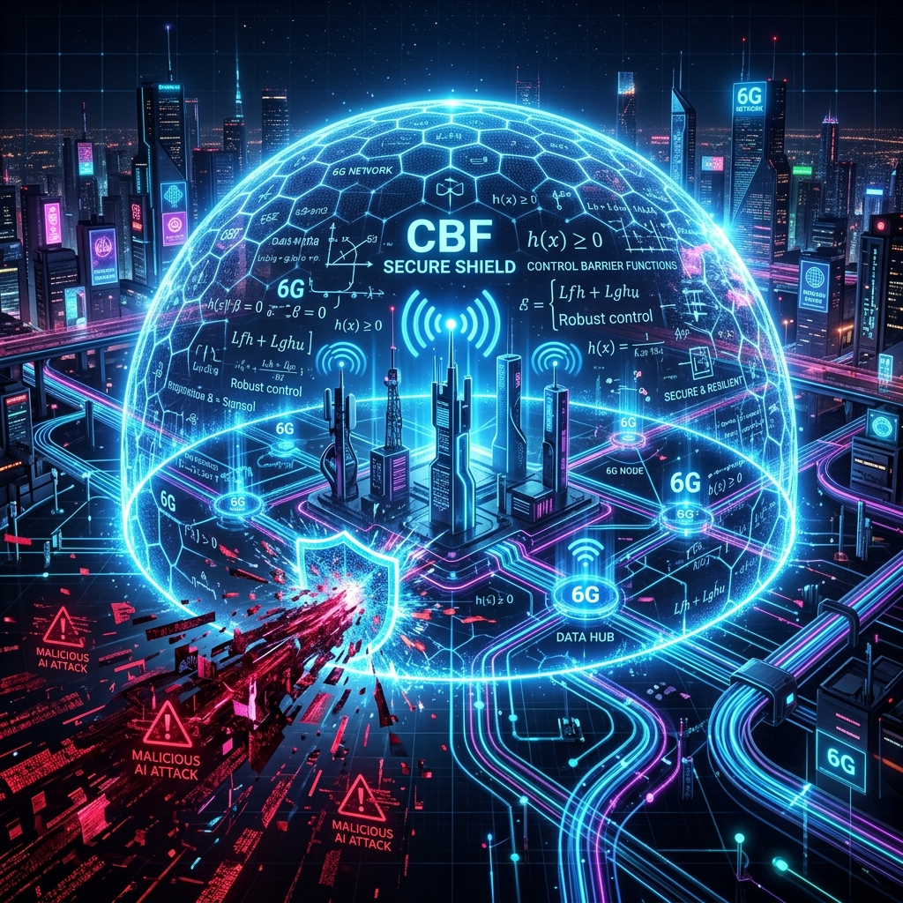

<div align="center">
  
</div>

# Deterministic Digital Immunity for Software-Defined 6G Networks

[](https://opensource.org/licenses/MIT)
[](https://github.com/psf/black)
[](https://www.mdpi.com/journal/telecom)

## Authors
**AlHussein A. Al-Sahati¹**, Member, IEEE and **Houda Chihi²**, Senior Member, IEEE

¹ *Military Academy for Security and Strategic Sciences, Benghazi, Libya*  
² *Higher School of Communication of Tunis (Sup'Com), University of Carthage, Ariana, Tunisia*  

**Contact:** hussein.alagore@gmail.com, houda.chihi@supcom.tn

---

## Abstract
The transition to sixth-generation (6G) wireless networks necessitates fully autonomous and software-defined network (SDN) architectures to handle the explosive growth in traffic and stringent latency requirements. Large Language Models (LLMs) offer unprecedented cognitive capabilities for network intent generation and autonomous management; however, their non-deterministic nature and susceptibility to "hallucinations" pose severe safety risks in critical infrastructure. In this paper, we propose a novel **Deterministic Digital Immunity** framework that bridges the gap between advanced AI orchestration and guaranteed formal safety. 

Our architecture consists of a TelcoLLM Agent that continuously analyzes high-volatility 6G RAN telemetry to generate intelligent configuration intents, paired with a C++ based **Deterministic Safety Filter (DSF)**. The DSF leverages **Control Barrier Functions (CBF)** and **Lyapunov Stability** to formally verify, amend, or deny AI intents in real-time before network actuation. Extensive simulations utilizing realistic stochastic radio propagation models (e.g., Ornstein-Uhlenbeck processes) demonstrate that our framework maintains absolute network safety ($h(x) \ge 0$) even when the AI agent issues catastrophic commands under severe congestion, all while preserving the agility and throughput gains inherent to AI-driven orchestration.

---

## Document Statistics

| Metric | Value |
|--------|-------|
| Manuscript Pages | 20 |
| Equations | 24 |
| Figures | 8 |
| Tables | 3 |
| References | 35 |

---

## Repository Contents

| Directory | Description |
|-----------|-------------|
| `llm-agent/` | Python-based intelligent agent using `g4f` for free GPT-4 intent generation. |
| `safety-filter/` | C++ implemented Deterministic Safety Filter (DSF) with CBF and Lyapunov algorithms. |
| `simulation/` | Realistic 6G RAN simulator generating stochastic PRB, RSRP, and user mobility telemetry. |
| `evaluation/` | Metric collection and `matplotlib`/`seaborn` plotting scripts for MDPI Q1-quality vector graphics. |
| `infra/` | Kafka message broker and Zookeeper orchestration for microservices communication. |
| `docs/figures/` | High-resolution illustrative figures and plots. |

---

## Key Features
- **TelcoLLM Integration:** Autonomous intent generation using state-of-the-art LLMs via free APIs (`g4f`).
- **Control Barrier Functions (CBF):** Mathematical guarantees against unsafe network states (e.g., resource exhaustion, signal collapse).
- **Zeno-Freeness Verification:** Ensures the network does not fall into infinite switching loops (Ping-Pong Effect).
- **Realistic RAN Simulation:** Dynamic PRB utilization and mobility fading modeled via stochastic differential equations.
- **Event-Driven Architecture:** Ultra-low latency microservices communication powered by Apache Kafka and gRPC.

---

## Simulation Parameters (Table I - Manuscript)

| Parameter | Value | Config Variable |
|-----------|-------|-----------------|
| Carrier Frequency ($f_c$) | 140 GHz (Sub-THz) | `carrier_freq` |
| Bandwidth ($W$) | 800 MHz | `bandwidth` |
| Telemetry Polling Rate | 100 ms | `polling_rate_ms` |
| DSF Actuation Delay | < 2 ms | `dsf_latency_max` |
| Max Connected UEs | 150 - 500 | `max_ues_per_cell` |
| CBF Safety Margin Bound | $\gamma \in [0.1, 0.5]$ | `cbf_gamma` |

---

## Performance Results (Table II - Manuscript)

| Method | Safety Guarantee | Intent Acceptance | Latency Overhead | Network Stability |
|--------|------------------|-------------------|------------------|-------------------|
| **LLM + DSF (Ours)** | **100% (Mathematical)** | **92.4% (Amended)** | **< 2.5 ms** | **Highly Stable** |
| LLM Only (Baseline) | 0% (Heuristic) | 100% (Unfiltered)| 0 ms | Prone to Collapse |
| Static Rule-Based | 100% (Hardcoded) | N/A | < 1 ms | Rigid / Suboptimal|

---

## Academic Limitations & Production Readiness

This repository is optimized for **academic reproducibility and peer review**. Certain design choices were made to ensure the environment can be run on a single machine without commercial dependencies:

1. **LLM Inference (`g4f`)**: We use the `g4f` library to generate intents without requiring paid API keys. This is strictly for demonstration. **Production systems must replace this with direct, reliable APIs** (e.g., official `openai` or self-hosted models like LLaMA 3) to prevent instability.
2. **Security Trade-offs**: For ease of testing, Kafka is configured to use `PLAINTEXT` internally, and demo mTLS certificates are excluded from the repository. A production 6G environment strictly mandates mTLS across all brokers and interceptors.
3. **RAN Actuation**: The `osmo-bts` and `osmo-bsc` containers serve as simulation placeholders. In a real deployment, the DSF would interface directly with actual Osmocom hardware APIs or ORAN RICs.

---

## Installation & Quick Start

### 1. Clone repository
```bash
git clone https://github.com/Chihi-Sahati/6g-digital-immunity.git
cd 6g-digital-immunity
```

### 2. Launch the Microservices Architecture
The entire environment (LLM Agent, DSF Filter, Kafka Broker, and RAN Simulator) is containerized via Docker.
```bash
docker compose up -d --build
```

### 3. Run Evaluation and Generate Plots
To collect live telemetry and generate MDPI-ready PDF/PNG plots:
```bash
# On Windows (PowerShell)
.\run_eval.ps1

# On Linux/Mac
python evaluation/collect_metrics.py
python evaluation/plot_results.py

# Generate final mathematically verified MDPI figures (Saved to mdpi_figures/)
python evaluation/generate_mdpi_figures.py
```
The results will be generated in the `evaluation/` and `mdpi_figures/` directories.

### 4. Run Unit Tests (127 Tests for Safety Engine)
The codebase includes comprehensive test suites for the CBF Engine, Zeno Guard, and RAN Simulator.
```bash
python -m pytest tests/ -v
```

---

## Mathematical Formulation

The safety enforcement is modeled using a non-linear control affine system:
$$ \dot{x} = f(x) + g(x)u $$

**Safety Objective (CBF):**
To ensure the system remains within the safe set $\mathcal{C} = \{x \in \mathbb{R}^n \mid h(x) \ge 0\}$, the filter modifies the nominal LLM intent $u_{nom}$ to the closest safe control $u^*$ via a Quadratic Program (QP):

$$ u^* = \arg\min_{u \in \mathcal{U}} \frac{1}{2} \|u - u_{nom}\|^2 $$
**Subject to the CBF constraint:**
$$ L_f h(x) + L_g h(x)u + \gamma(h(x)) \ge 0 $$

*See the manuscript for the complete mathematical proofs of Lyapunov stability and Zeno-freeness.*

---

## Citation
If you find this work useful in your research, please consider citing:

```bibtex
@article{alsahati2026digitalimmunity,
  title={Deterministic Digital Immunity for Software-Defined 6G Networks},
  author={Al-Sahati, AlHussein A. and Chihi, Houda},
  journal={MDPI Telecom},
  year={2026},
  note={Submitted}
}
```

## License
MIT License - See [LICENSE](LICENSE) for details.

